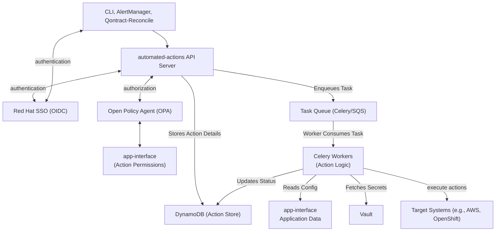

# Automated Actions 🚀

[](https://github.com/astral-sh/ruff)
[](https://github.com/astral-sh/uv)
[](https://fastapi.tiangolo.com/)
[](https://docs.celeryproject.org/en/stable/)
[](https://github.com/app-sre/automated-actions/blob/61d63cdc012c9ddf93e938ebb07446bce49421ed/LICENSE)


Welcome to the Automated Actions project! 👋 This system provides a toolset for predefined actions that can be self-serviced by tenants or automatically triggered by events.

## 📚 Table of Contents

- [📚 Table of Contents](#-table-of-contents)
- [🎯 Problem Statement](#-problem-statement)
- [✨ Goals](#-goals)
- [🌟 Key Features](#-key-features)
- [🏗️ Architecture Overview](#️-architecture-overview)
- [🔑 Key Concepts](#-key-concepts)
  - [🏷️ Action Types](#️-action-types)
- [🧩 Packages Overview](#-packages-overview)
  - [📦 `automated_actions`](#-automated_actions)
  - [🤖 `automated_actions_client`](#-automated_actions_client)
  - [💻 `automated_actions_cli`](#-automated_actions_cli)
  - [🛡️ `opa`](#️-opa)
  - [🧪 `integration_test`](#-integration_test)
  - [🛠️ `automated_actions_utils`](#️-automated_actions_utils)
- [🛠️ Tech Stack](#️-tech-stack)
  - [⚙️ Configuration](#️-configuration)
- [🎬 Action Overview](#-action-overview)
  - [✅ Available Actions](#-available-actions)
  - [📝 Planned Actions](#-planned-actions)
- [🚀 Development Setup](#-development-setup)
  - [📋 Prerequisites](#-prerequisites)
  - [🛠️ Setting up the Environment](#️-setting-up-the-environment)
  - [⚙️ Local Configuration](#️-local-configuration)
  - [▶️ Running the Application (Locally)](#️-running-the-application-locally)
  - [🔬 Testing](#-testing)
  - [Linting and Formatting](#linting-and-formatting)
  - [Release](#release)
  - [📚 Development Guides](#-development-guides)
- [💡 Usage Examples](#-usage-examples)
  - [⌨️ CLI Usage](#️-cli-usage)
- [☁️ Deployment](#️-deployment)
- [🤝 Contributing](#-contributing)
- [📜 License](#-license)

## 🎯 Problem Statement

AppSRE tenants regularly require manual intervention from AppSRE for various operational tasks. This project aims to establish a toolset allowing a set of predefined actions to be either self-serviced by tenants or automatically triggered by events (e.g., alerts). This reduces manual workload and improves response times. ⏱️

See

## ✨ Goals

- **🧩 Extensibility:** Easily add new automated actions.
- **🔍 Discoverability:** Actions should be stored and discoverable by users.
- **🛡️ Security:** Implement robust authentication and authorization.
- **⚙️ Flexible Triggers:** Support manual (user-initiated) and automated (event-driven, e.g., AlertManager, cron) triggers.
- **📊 Output Accessibility:** Action outputs (logs, dumps) must be accessible to the requester.
- **🚦 Throttling:** Provide mechanisms to prevent system abuse or overload.

## 🌟 Key Features

- **🚀 Flexible Action Initiation:** Supports both manual self-service by users and automated triggering by system events (e.g., alerts).
- **🖥️ Centralized API Control:** A dedicated API server for managing, tracking, and orchestrating all automated actions.
- **💨 Scalable Asynchronous Processing:** Employs a robust task queue system for efficient and reliable execution of actions in the background.
- **💾 Robust State Management & Throttling:** Persistently stores action status and enforces operational limits to ensure system stability.
- **🔒 Enterprise-Grade Security:** Implements strong authentication (e.g., OIDC via Red Hat SSO) and fine-grained, configuration-driven authorization.
- **📜 Declarative Action & Policy Definition:** System behavior, including available actions, permissions, and operational parameters, is defined via externalized configuration (app-interface).
- **⌨️ Dedicated User Interface:** Offers a command-line tool (CLI) for tenants to easily trigger and monitor actions.

## 🏗️ Architecture Overview

The system is centered around a FastAPI server that orchestrates actions triggered by users or automated systems.



1. **FastAPI Server (automated-actions):**
    - The central component.
    - Receives requests from users via the **CLI** or from **AlertManager** (webhooks).
    - Handles **authentication via Red Hat SSO (OIDC)**.
    - Performs **authorization based on configurations in app-interface**.
    - Validates requests and checks throttling limits (using DynamoDB).
    - Assigns a unique ID, **stores the action details in DynamoDB**, and **enqueues the task in Celery via AWS SQS**.
    - Provides endpoints to query action status.
2. **CLI (Command Line Interface):**
    - The primary tool for users/tenants to interact with the FastAPI server to trigger actions.
3. **Task Queue (Celery & SQS):**
    - Manages asynchronous execution of actions. FastAPI sends tasks to SQS, and Celery workers pick them up.
4. **DynamoDB:**
    - Used by FastAPI and Celery to store action requests, their status, and timestamps for throttling.
5. **Celery Workers:**
    - Execute the logic for each predefined action.
    - Fetch necessary configuration from **app-interface** and secrets/credentials from **Vault**.
    - Interact with target systems to perform actions (e.g., **AWS RDS reboot, OpenShift Pod restart**).
    - Update action status in DynamoDB.
6. **Configuration (app-interface):**
    - Defines action permissions (authorization rules), and throttling parameters.

## 🔑 Key Concepts

### 🏷️ Action Types

1. **Automated Actions:** Triggered by end-users (typically AppSRE tenants) via the CLI.
    - Example: Restarting a specific deployment.
2. **Automatic Remediations:** (*not implemented yet*) Triggered by alerting systems (e.g., AlertManager webhooks).
    - Example: Automatically restarting a stuck integration based on an alert.

## 🧩 Packages Overview

This project is structured into several key packages, each with a distinct role:

### 📦 `automated_actions`

The heart of the system! 💪 This package contains the **FastAPI server** application and the Celery task queue. It exposes the API endpoints, handles incoming requests, orchestrates task queuing, and manages the state of automated actions.

### 🤖 `automated_actions_client`

Your friendly Python helper for talking to the API! 🐍 This is an **auto-generated Python HTTP client**, created directly from the project's OpenAPI (Swagger) documentation. It simplifies programmatic interaction with the `automated_actions` server.

### 💻 `automated_actions_cli`

The command center for users! 🚀 This package provides the **Command Line Interface (CLI)**. Tenants and SREs use this tool to trigger actions, check their status, and interact with the automated actions system from their terminals.

### 🛡️ `opa`

Guardian of the gates! 🗝️ This directory houses the **Open Policy Agent (OPA) Rego files**. These files define the authorization and throttling policies and rules that determine who can perform which actions under what conditions, ensuring secure and controlled operations.

### 🧪 `integration_test`

Putting it all together! 🔬 This package contains the **integration tests**. These tests verify that the different components of the system (API, workers, database, etc.) work correctly in concert, ensuring end-to-end functionality.

### 🛠️ `automated_actions_utils`

The shared toolbox! 🔧 This package provides **common utility functions and API implementations** used across other packages. This includes convenient wrappers for interacting with services like HashiCorp Vault (for secrets) and AWS APIs (e.g., for SQS, DynamoDB), promoting code reuse and consistency.

## 🛠️ Tech Stack

- **Backend API:** Python 🐍, FastAPI 🚀
- **Task Queue:** Celery 🐘
- **Message Broker:** AWS SQS ✉️
- **Database:** AWS DynamoDB 🗂️
- **Authentication/Authorization:** Red Hat SSO (OIDC) 🔑, Open Policy Agent (OPA) 🛡️
- **Linting/Formatting:** [Ruff](https://github.com/astral-sh/ruff) ✨
- **Package Management:** [uv](https://github.com/astral-sh/uv) 📦

### ⚙️ Configuration

Action permissions and throttling limits are defined in the `app-interface`. This declarative approach allows for centralized management and easy auditing of system behavior. The qontract-reconcile [automated-actions-config integration](https://github.com/app-sre/qontract-reconcile/blob/4236821459c9d1bb833a1fc68c773cec53a781b1/reconcile/automated_actions/config/integration.py) transforms these configurations into the OPA policy files.

## 🎬 Action Overview

This project provides a set of predefined actions that can be triggered by users or automatically by the system. Each action is designed to perform specific tasks on target systems, such as restarting workloads in OpenShift or rebooting AWS RDS instances.

### ✅ Available Actions

Refer to [actions.md](/actions.md) for a detailed list of available actions, their parameters, and usage examples.

### 📝 Planned Actions

- 📄 Getting application configuration and logs.
- 💾 Obtaining heap dumps.
- ⚙️ Automatically restarting stuck integrations.
- 🤖 Recycling stuck Jenkins workers.

## 🚀 Development Setup

### 📋 Prerequisites

- Python (see `.python-version` or `pyproject.toml` for specific version)
- `uv` (for Python environment and package management)
- `make`
- AWS CLI configured (for local DynamoDB/SQS interaction if not using mocks, and for deployment)
- Access to relevant qontract-server and Vault instances (for action execution logic)
- Docker (for running local dependencies like LocalStack)

### 🛠️ Setting up the Environment

1. **Clone the repository:**

    ```bash
    git clone https://github.com/chassing/automated-actions.git
    cd automated-actions
    ```

2. **Set up the development environment:**
    This command creates/updates a virtual environment using `uv` and installs dependencies.

    ```bash
    make dev-env
    ```

3. **Activate the virtual environment:**

    ```bash
    source .venv/bin/activate
    ```

### ⚙️ Local Configuration

Configure all required settings in a local `settings.conf` file in the project root directory (ignored by git).

Please find and use predefined setting files in Vault:

- **AppSRE**: Use [app-sre-only-settings](https://vault.devshift.net/ui/vault/secrets/app-interface/kv/automated-actions%2Fdevelopment%2Fapp-sre-only-settings/details?version=1)
- **Other Red Hat employees**: TODO: Create a similar settings file in Vault for other Red Hat employees.

Refer to the [settings documentation](/settings.md) for details on all available automated-actions settings.

### ▶️ Running the Application (Locally)

Use the provided [docker-compose.yml](/docker-compose.yml) file to run the application and its dependencies (like LocalStack for AWS services) locally.

```bash
docker-compose up automated-actions # Or 'docker-compose up -d' for detached mode
```

This will typically start the FastAPI server, Celery workers, OPA, and mock AWS services. Check the `docker-compose.yml` for specific service names and configurations.

### 🔬 Testing

Run the main test suite from the root directory:

```bash
make test
```

Each package may also have its own test suite. To run tests for a specific package:

```bash
cd packages/automated_actions
make test
```

### Linting and Formatting

This project uses [Ruff](https://github.com/astral-sh/ruff) for linting and formatting. To check for issues:

```bash
make format
```

### Release

`automated-actions-client` and `automated-actions-cli` are released to PyPI. To release a new versions:

1. Recreate the `automated-actions-client` package after changes to the OpenAPI spec.

    ```bash
    make generate-client
    ```

1. Update the version numbers in [automated_actions_client/pyproject.toml](/packages/automated_actions_client/pyproject.toml). [automated_actions_cli/pyproject.toml](/packages/automated_actions_cli/pyproject.toml).
1. Create and merge a PR.

### 📚 Development Guides

Feel free to explore our [development guides](/docs/development-guides/) to enhance your understanding and contribution to the Automated Actions project!

## 💡 Usage Examples

### ⌨️ CLI Usage

**Action:** Restart an OpenShift Deployment.
(Assuming `automated-actions-cli` is installed or you entered your local development virtual environment)

```bash
automated-actions openshift-workload-restart --cluster <CLUSTER_NAME> --namespace <NAMESPACE_NAME> --kind Pod --name <POD_NAME>
```

Refer to the `automated_actions_cli` package `README.md` for detailed usage instructions.

## ☁️ Deployment

Deployment is managed using OpenShift templates. Refer to the `openshift` directory in the root of this repository for specific templates and deployment instructions.

## 🤝 Contributing

Contributions are welcome! 🎉 Please follow standard practices:

1. Fork the repository.
2. Create a feature branch (`git checkout -b feature/your-amazing-feature`).
3. Make your changes.
4. Ensure tests pass (`make test`).
5. Ensure code is linted and formatted (`make format`).
6. Commit your changes (`git commit -m 'feat: Add some amazing feature'`).
7. Push to the branch (`git push origin feature/your-amazing-feature`).
8. Open a Pull Request.

## 📜 License

This project is licensed under the terms of the [Apache 2.0 license](/LICENSE).
